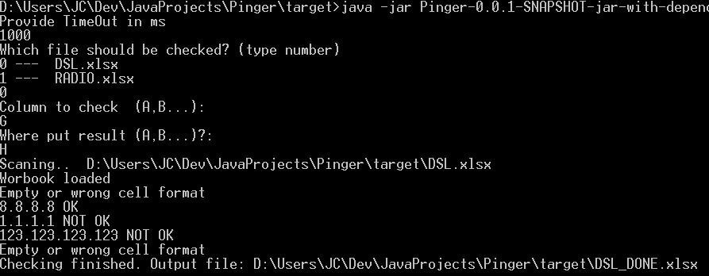

# Pinger
Application useful with checking reachability of a lot of ip addresses
## Installation

    mvn clean package
## Running
    java -jar Pinger-0.0.1-SNAPSHOT.jar
    

At begin there is need to define timeout in ms (for 1s -> 1000)

Then pick file (there are listed xlsx files from directory where is jar file saved)

After that provide col which should be checked and than col where should be result placed.
Thats all You need. Program will check each row and write result to proper column. After last row will be scaned program will save output file as "startFile"_DONE.xlsx.  
